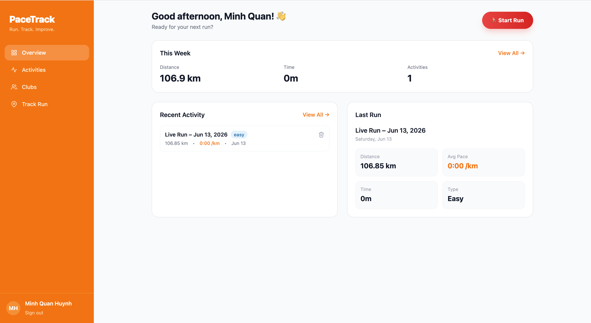
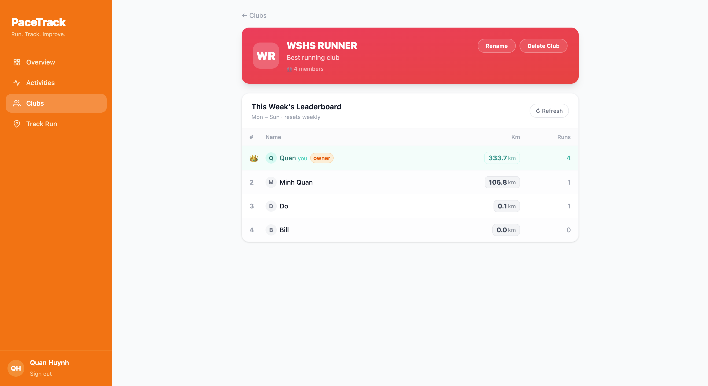

# PaceTrack

A full-stack running tracker — log workouts, watch your pace compute automatically, race friends on club leaderboards, and own your entire training history.

**Live demo:** https://pace-track.vercel.app

---

## Screenshots

| Tracking Screen | Club Leaderboard |
|---|---|
|  |  |

---

## Features

- **Live GPS Tracking** — Start a run and watch your route traced on a Mapbox map in real time. Pace, speed, distance, elevation, and calories update as you move.
- **Run History** — Log runs manually or save live sessions. Browse with filter chips (All / This week / This month / Easy / Hard).
- **Club Leaderboards** — Create or join a club. Compete on weekly mileage with a leaderboard that updates live via Socket.io the moment a clubmate finishes a run.
- **GPX Upload** — Import `.gpx` files from Garmin, Apple Watch, or Strava.
- **Personal Records** — Fastest pace, longest run, and best weekly km tracked automatically.

---

## Tech Stack

| Layer | Tech |
|---|---|
| Frontend | React 19, Vite, TypeScript, Tailwind CSS v4, Mapbox GL JS |
| Backend | Node.js, Express 5, TypeScript, Socket.io |
| Database | MongoDB Atlas (Mongoose) |
| Storage | AWS S3 (GPX uploads) |
| Auth | JWT access + refresh tokens (httpOnly cookies) |
| Deploy | Vercel (frontend) · Render (backend) |

---

## Local Setup

### Prerequisites

- Node.js 18+
- [MongoDB Atlas](https://www.mongodb.com/atlas) cluster (free M0 tier works)
- [Mapbox](https://mapbox.com) public token (free)
- AWS S3 bucket — only needed for GPX upload feature

### 1. Clone

```bash
git clone https://github.com/nhuynh30/PaceTrack.git
cd PaceTrack
```

### 2. Backend

```bash
cd backend
npm install
cp .env.example .env   # then fill in values
npm run dev            # http://localhost:8000
```

**`backend/.env`**
```env
MONGODB_URI=mongodb+srv://...
JWT_SECRET=long-random-string
JWT_EXPIRES_IN=15m
REFRESH_SECRET=another-long-random-string
REFRESH_EXPIRES_IN=7d
PORT=8000

# Comma-separated allowed frontend origins
ALLOWED_ORIGINS=http://localhost:5173

# Open Elevation API (free, no key required)
OPEN_ELEVATION_URL=https://api.open-elevation.com/api/v1/lookup

# AWS S3 — optional, only for GPX uploads
AWS_ACCESS_KEY_ID=
AWS_SECRET_ACCESS_KEY=
AWS_REGION=ap-southeast-1
S3_BUCKET=
```

### 3. Frontend

```bash
cd frontend
npm install
cp .env.example .env   # or create manually
npm run dev            # http://localhost:5173
```

**`frontend/.env`**
```env
VITE_API_URL=http://localhost:8000/api/v1
VITE_MAPBOX_TOKEN=pk.your_mapbox_public_token
```

---

## Deploy

### Backend → Render

1. [render.com](https://render.com) → **New → Web Service** → connect your GitHub repo
2. **Root directory:** `backend`
3. **Build command:** `npm install && npm run build`
4. **Start command:** `node dist/index.js`
5. Add all backend env vars in the **Environment** tab, and set:
   ```
   ALLOWED_ORIGINS=https://your-app.vercel.app
   ```
6. Note the deployed URL (e.g. `https://pacetrack.onrender.com`)

### Frontend → Vercel

1. [vercel.com](https://vercel.com) → **New Project** → import the repo
2. **Root directory:** `frontend`
3. **Environment variables:**
   ```
   VITE_API_URL=https://pacetrack.onrender.com/api/v1
   VITE_MAPBOX_TOKEN=pk.your_mapbox_public_token
   ```
4. **Production branch:** `main` — Vercel auto-deploys on every push

---

## Project Structure

```
PaceTrack/
├── backend/
│   └── src/
│       ├── routes/       # Express route handlers
│       ├── models/       # Mongoose schemas
│       ├── middleware/   # Auth, error handling, rate limiting
│       └── socket.ts     # Socket.io setup
└── frontend/
    └── src/
        ├── pages/        # Route-level components
        ├── hooks/        # Custom React hooks (useRuns, useClubs…)
        └── lib/          # Axios instance, socket client
```

---

## Authors

- **Quan Huynh** — Backend, API, database, deployment
- **Huy Pham** — Frontend, UI, maps

---

## License

MIT
